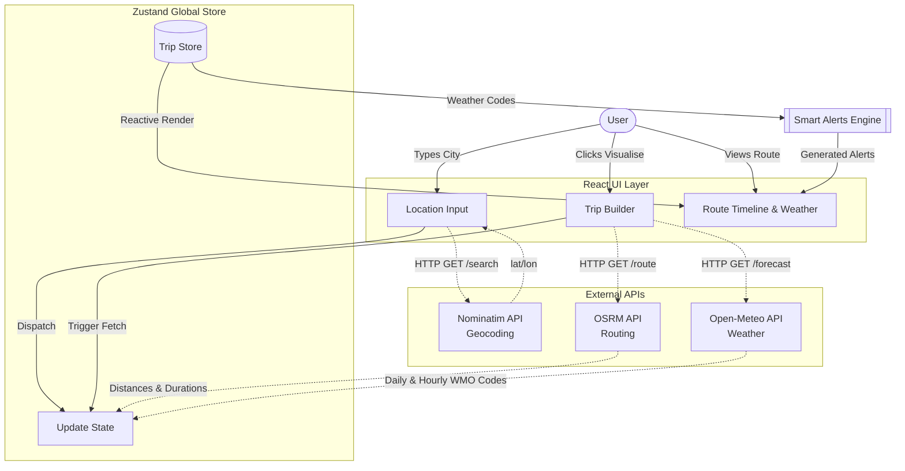

# WanderRoute Trip Planner: Architecture & Data Sources

This document outlines how WanderRoute fetches, processes, and displays data to the user, alongside a high-level system architecture diagram.

## 1. Data Sources & External Services

WanderRoute is built using entirely free, open-source APIs with no authentication keys required. Here is a breakdown of the external services used:

### A. Location Search & Geocoding
- **Service:** [Nominatim (OpenStreetMap)](https://nominatim.openstreetmap.org/)
- **Usage in App:** When a user types in the `LocationInput` component, the app sends a debounced query (to respect the 1 req/sec rate limit) to Nominatim. 
- **What is displayed:** It returns the city, state, country, and precise `latitude` and `longitude` coordinates.

### B. Routing & Distances
- **Service:** [OSRM (Open Source Routing Machine)](https://router.project-osrm.org/)
- **Usage in App:** Once locations are selected, the app calculates the driving distance and duration. To ensure high accuracy and avoid OSRM multi-waypoint snapping bugs over long distances, the app fetches the route **leg-by-leg** (e.g., Stop 1 -> Stop 2, then Stop 2 -> Stop 3).
- **What is displayed:** The timeline (`RouteVisualizer`) displays the segment distance in kilometers (e.g., `675 km`) and estimated driving duration (e.g., `13h 17m`).

### C. Weather Forecasts
- **Service:** [Open-Meteo API](https://open-meteo.com/)
- **Usage in App:** The app fetches a 7-day forecast for the exact coordinates of every stop on the trip. It requests both daily summaries and hourly temperature/precipitation data.
- **What is displayed:** 
  - **Timeline:** Displays the daily summary (max temp, weather icon) for the day of arrival/departure.
  - **Weather Grid:** Displays a detailed card for every day of the stay, including High/Low temps, total precipitation, and a specific 3-point hourly breakdown (8 AM, 2 PM, 8 PM) for deep context.

### D. Smart Alerts (Simulated)
- **Service:** Internal logic (`src/api/alerts.ts`) derived from Open-Meteo.
- **Usage in App:** Instead of a dedicated IMD API, the app analyzes the WMO (World Meteorological Organization) weather codes returned by Open-Meteo.
- **What is displayed:** If extreme weather (like Code 95: Thunderstorm, or Code 65: Heavy Rain) is detected on a day the user is visiting a stop, the app dynamically renders a `Yellow Alert` or `Red Alert` banner disguised as a "Gov / IMD Alert" to prepare the user for travel delays.

---

## 2. Architecture Diagram

Below is the high-level data flow diagram of the React application. 

## 3. Data Flow Summary
1. The user inputs their desired stops in the **React UI Layer**.
2. The UI queries the **External APIs** (Nominatim) for coordinates.
3. Upon confirming the trip, the app queries OSRM for distances and Open-Meteo for weather, combining the data in the **Zustand Global Store**.
4. The **Smart Alerts Engine** scans the store for dangerous weather codes and injects alerts into the UI.
5. The **React UI Layer** automatically re-renders, displaying the rich timeline and detailed weather grids.
